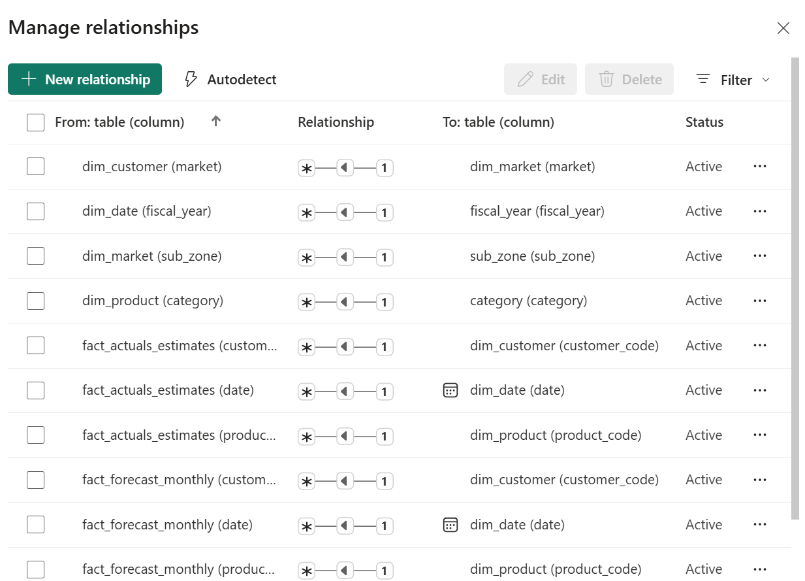
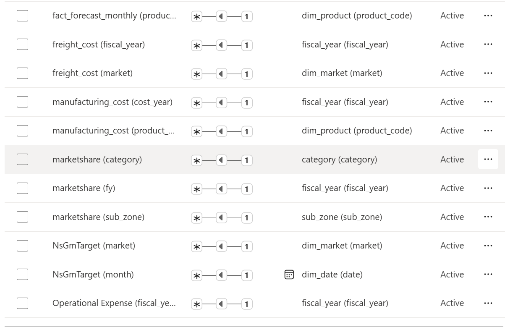
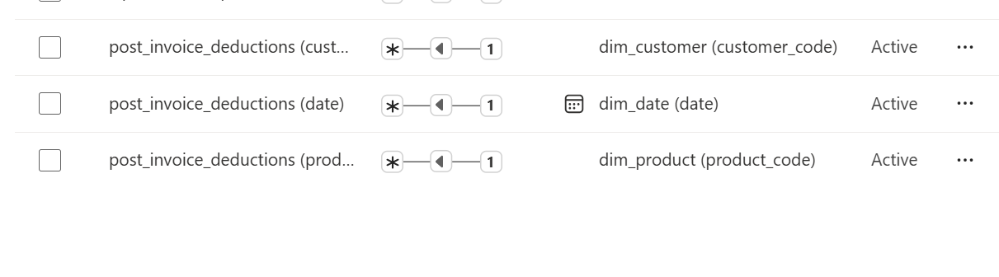

# Financial Analytics Dashboard (Power BI)

## Overview
This Power BI dashboard provides financial analytics and business insights for Atliq Hardware by connecting to an SQL database. It integrates data from finance, operations, and marketing to address real-world business problems with metrics on profitability, forecasting, and market performance.

[View Live Dashboard](https://app.powerbi.com/groups/me/reports/340d9d72-224f-4e94-8be3-d5e4d9c727f5/ReportSection3e6d270a5b20870d7cd8?experience=power-bi)

## Dashboard Screenshots

### Executive Summary

This section provides a high-level overview of key financial metrics, including total revenue, net profit, and year-over-year growth trends to give stakeholders a quick snapshot of the company's performance.

### Profitability & Revenue Insights

This dashboard breaks down profitability by product and customer segments, highlighting gross margins, net sales, and cost drivers to identify areas for improvement in revenue generation.

### P&L & Market Performance

Focusing on profit and loss analysis alongside market share trends, this view shows variance drivers, operational costs, and market performance metrics to support strategic decision-making.

## Key Features
- Profitability and revenue metrics (net sales, gross margin, net profit, year-over-year trends)
- Forecasting and variance analysis
- Operational cost drivers (manufacturing, freight, promotions)
- Market and product analytics (market share, performance drivers)
- Interactive visualizations with drill-through, tooltips, and slicers

## Technologies Used
- Power BI Desktop and Service
- DAX for calculations and time intelligence
- Data modeling with star schema
- SQL and Excel for data preparation
- Performance optimization with DAX Studio

## Data Modeling

### Star Schema Overview
The data model employs a star schema with fact tables connected to dimension tables for efficient querying and analysis.

- **Fact Tables**: Sales, Inventory
- **Dimension Tables**: Customer, Product, Date, Geography

### Relationships Diagrams

This diagram illustrates the relationships between the Sales fact table and dimension tables such as Customer and Product.

This shows connections involving the Date dimension for time-based analysis.

This diagram highlights relationships for inventory and supply chain metrics.

## Business Questions Addressed
- Product and customer profitability
- Forecast accuracy vs. actuals
- ROI on marketing and promotions
- Drivers of P&L variance
- Market share trends

## About
Caroline Mibei - Data Analytics Professional

- Email: cmibei@gmail.com
- LinkedIn: [Caroline Chebet](https://www.linkedin.com/in/caroline-chebet-41683074/)
- GitHub: [YAOD-WP](https://github.com/YAOD-WP)

## License
This project is licensed under the MIT License.
